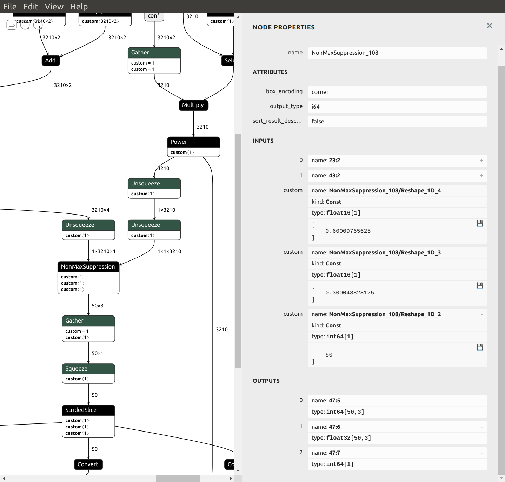
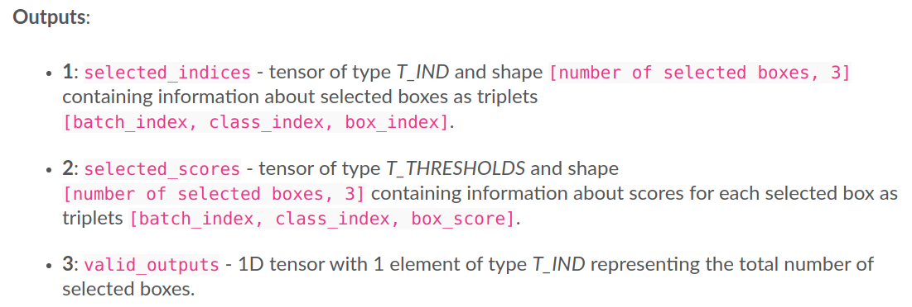
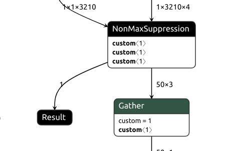
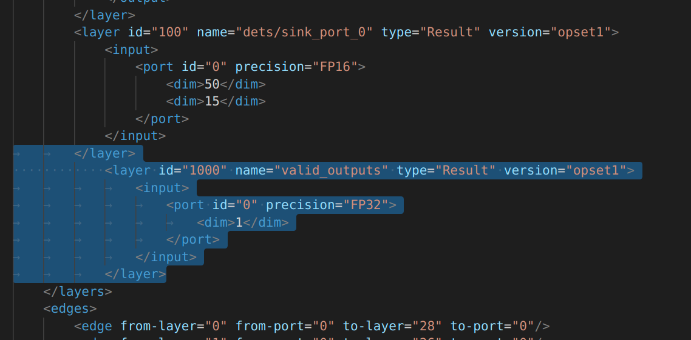
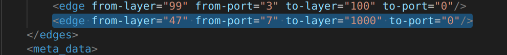

### Some explanations on the creation of the Post Processing model. 

The first 5 steps below are done by running:
```
python3 generate_postproc_onnx.py -H 180 -W 320 -top_k 50 -score_thresh 0.6
```
1) The model is a procedural (not trained) model created from scratch using pytorch :
    ```
    class YunetPostProcessing(nn.Module):
    ...
    ```
2) The model takes as input the 3 outputs of the Yunet model:
    ```
    def forward(self, loc, conf, iou):
        # loc.shape: Nx14
        # conf.shape: Nx2
        # iou.shape: Nx1
    ```
    Note that N depends on the input resolution of the Yunet model. For instance, N=786 for 90x160, N=13150 for 360x640.

3) In the forward function, some simple processing are applied to the data before caling the `torchvision.ops.nms()` function which performs non-maximum suppression on the boxes according to their intersection-over-union:
    ```
    keep_idx = nms(bboxes, scores, iou_threshold)[:self.top_k]
    ```
    Unfortunately, the [parameters](https://pytorch.org/vision/stable/ops.html#torchvision.ops.nms) of `torchvision.ops.nms()` do not allow to limit the maximum number of boxes we want to keep. 

4) The pytorch model is then exported in ONNX format. Using Netron, we can see that the pytorch nms is converted into ONNX NonMaxSuppression:

ONNX NonMaxSuppression has more [parameters](https://github.com/onnx/onnx/blob/master/docs/Operators.md#NonMaxSuppression) than pytorch nms. In particular, `max_output_boxes_per_class` limits the number of boxes to be selected per batch per class. In the image above, we see that its value has been set to a huge value (9223372036854775807) during the convertion process, meaning there is no limit in practice. Moreover, from the documentation, we see that ONNX NonMaxSuppression supports the input `score_threshold` (boxes with score below that threshold are removed). This optional input does not appear here since `score_threshold` is not used in `torchvision.ops.nms()`.
5) Using onnx_graphsurgeon, we apply 2 modifications to the ONNX model:
    - `max_output_boxes_per_class` is patched to a reasonable user-defined value (top_k=50);
    - the input `score_threshold` is added to the NonMaxSuppression node with a user-defined value (here 0.6).
    
    
6) The next 3 steps including this one are done with the following command:

    ```
    ./build_postproc_blob.sh -m postproc_yunet_top50_th60_180x320.onnx
    ```

    The patched ONNX model is converted into OpenVINO IR FP16.
    Under Netron, we see that ONNX NonMaxSuppression has been converted into [OpenVINO NanMaxSUppression-5](https://docs.openvinotoolkit.org/latest/openvino_docs_ops_sort_NonMaxSuppression_5.html).
    

    Note that OpenVINO NonMaxSUppression-5 has 3 outputs :
    
    In the converted model, only the output `selected_indices` is used.
7) Patch the IR xml file in order to set the NonMaxSUppression-5 third output `valid_outputs` as a model global output:
    

    So now, the model has 2 global outputs:
    - an array of 50 boxes, where only the first entries correspond to valid boxes;
    - the number of the valid boxes. Without this number, as the non valid entries can be filled with garbage, a non valid entry could be wrongly considered as a valid entry. 

    The patch consists in adding a new layer in the xml file:

    

    and a new edge :

    

8) Finally compile the patched IR model into a blob file


## Why the patches ?

Patching `max_output_boxes_per_class` improves significantly the processing speed. For a resolution of 360x640 (13150 boxes), the complete application FPS is around 2 without the patch vs 35 with the patch !

Patching `score_threshold` also improves the speed but only marginally (a few fps).

Patching the xml file brings a way for the user to filter out the non valid boxes.