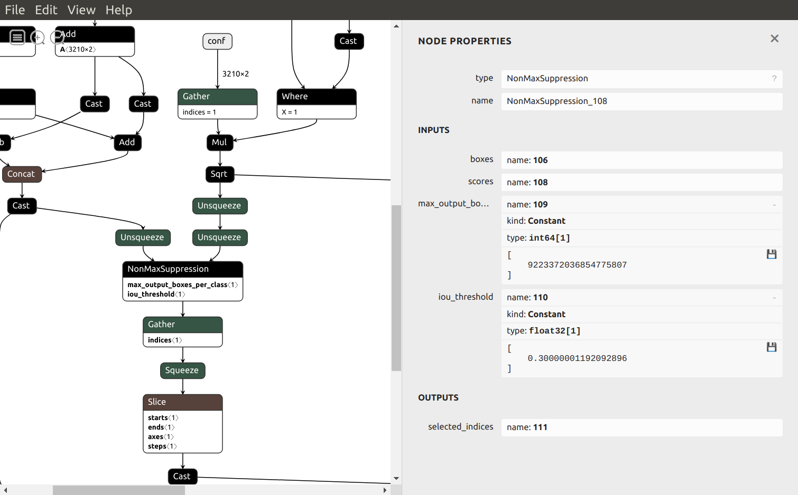
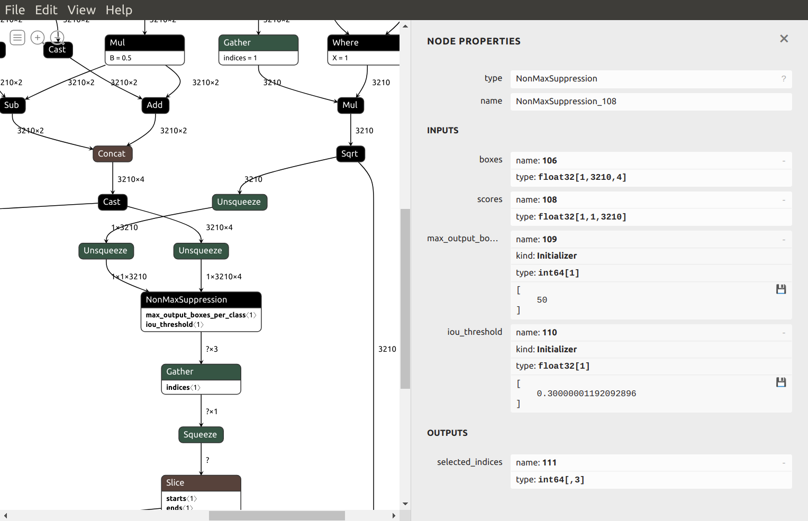
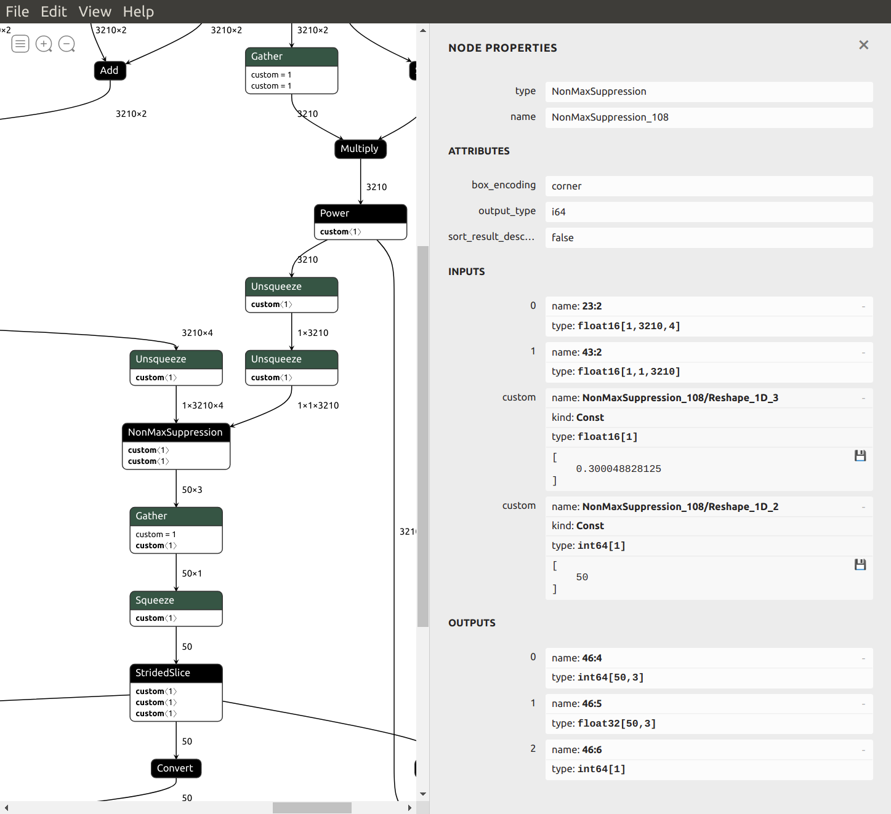

Some explanations on the creation of the Post Processing model. The first 5 steps below are done by a call to:
```
python3 generate_postproc_onnx.py -H 180 -W 320 -top_k 50
```
1) The model is a procedural (not trained) model created from scratch using pytorch :
    ```
    class YunetPostProcessing(nn.Module):
    ...
    ```
2) The model takes as input the 3 outputs of the Yunet model:
    ```
    def forward(self, loc, conf, iou):
        # loc.shape: Nx14
        # conf.shape: Nx2
        # iou.shape: Nx1
    ```
    Note that N depends on the input resolution of the Yunet model. For instance, N=786 for 90x160, N=13150 for 360x640.

3) In the forward function, some simple processing are applied to the data before caling the `torchvision.ops.nms()` function which performs non-maximum suppression on the boxes according to their intersection-over-union:
    ```
    keep_idx = nms(bboxes, scores, iou_threshold)[:self.top_k]
    ```
    Unfortunately, the [parameters](https://pytorch.org/vision/stable/ops.html#torchvision.ops.nms) of `torchvision.ops.nms()` do not allow to limit the maximum number of boxes we want to keep. 

4) The pytorch model is then exported in ONNX format. Using Netron, we can see that the pytorch nms is converted into ONNX NonMaxSuppression:

ONNX NonMaxSuppression has more [parameters](https://github.com/onnx/onnx/blob/master/docs/Operators.md#NonMaxSuppression) than pytorch nms. In particular, `max_output_boxes_per_class` limits the number of boxes to be selected per batch per class. In the image above, we see that its value has been set to a huge value (9223372036854775807) during the convertion process, meaning there is no limit in practice.
5) Using onnx_graphsurgeon, `max_output_boxes_per_class` is patched to a reasonable user-defined value (top_k=50):

6) The patched ONNX model is converted into OpenVINO IR FP16 then compiled into a blob file with the following command:
    ```
    ./build_blob_from_onnx.sh -m postproc_yunet_top50_180x320.onnx
    ```
    The ONNX NonMaxSuppression is converted into [OpenVINO NanMaxSUppression-5](https://docs.openvinotoolkit.org/latest/openvino_docs_ops_sort_NonMaxSuppression_5.html).
    
    ```
    <layer id="46" name="NonMaxSuppression_108" type="NonMaxSuppression" version="opset5">
        <data box_encoding="corner" sort_result_descending="false" output_type="i64"/>
        <input>
            <port id="0" precision="FP16">
                <dim>1</dim>
                <dim>3210</dim>
                <dim>4</dim>
            </port>
            <port id="1" precision="FP16">
                <dim>1</dim>
                <dim>1</dim>
                <dim>3210</dim>
            </port>
            <port id="2" precision="I64">
                <dim>1</dim>
            </port>
            <port id="3" precision="FP16">
                <dim>1</dim>
            </port>
        </input>
        <output>
            <port id="4" precision="I64" names="111">
                <dim>50</dim>
                <dim>3</dim>
            </port>
            <port id="5" precision="FP32">
                <dim>50</dim>
                <dim>3</dim>
            </port>
            <port id="6" precision="I64">
                <dim>1</dim>
            </port>
        </output>
    </layer>
    ```

Note that patching `max_output_boxes_per_class` improves significantly the processing speed. For a resolution of 360x640, the complete application FPS is around 2 without the patch vs 35 with the patch.